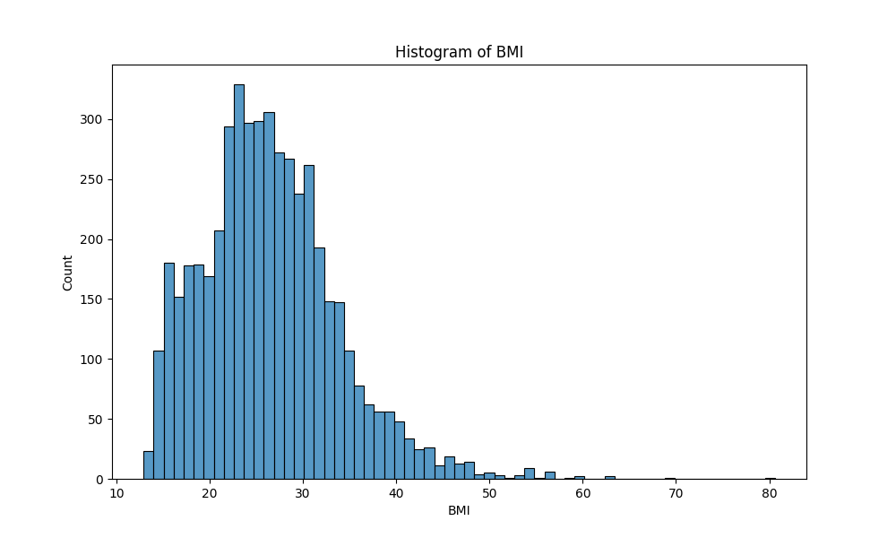
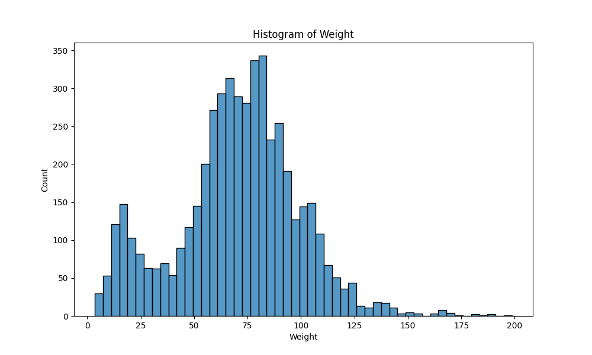
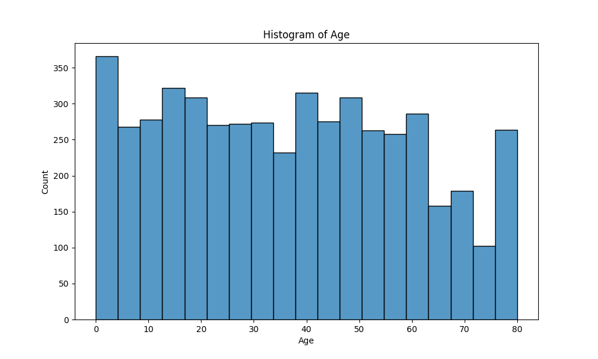
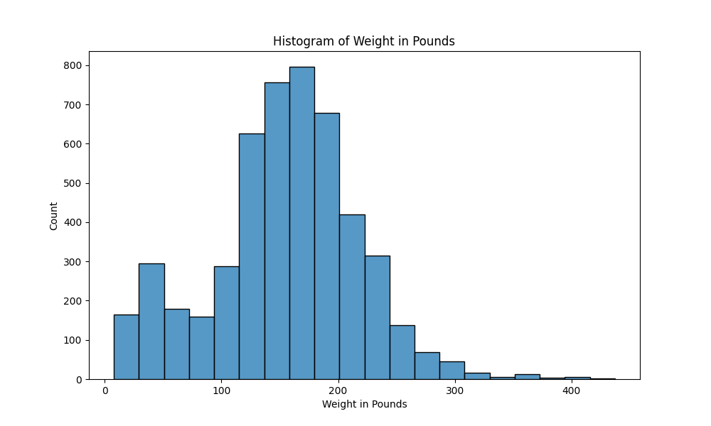
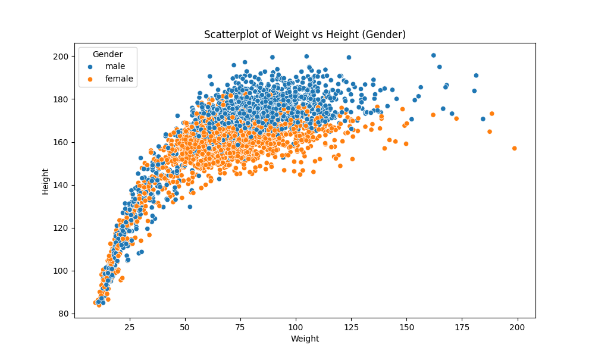
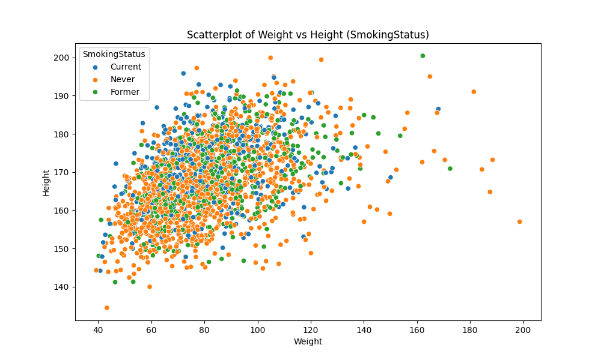
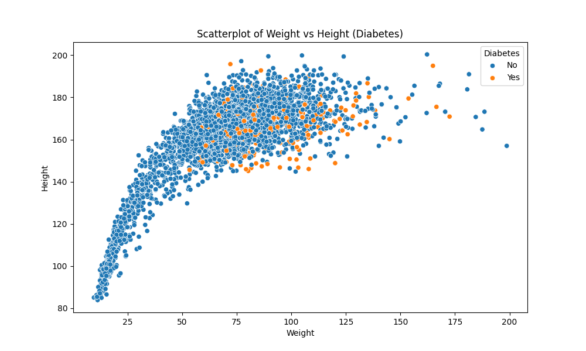

# NHANES Data Analysis Project

## Overview

In this project, we analyze the NHANES dataset, performing data cleaning, visualization, and statistical analysis. The dataset contains various health-related attributes, including BMI, weight, age, blood pressure, income, and lifestyle factors such as smoking and alcohol consumption. Our analysis includes generating histograms, scatter plots, and conducting statistical tests to uncover patterns and relationships in the data.

## Steps to Complete the Analysis

### 1. Load the Dataset

We load the NHANES dataset using Pandas:

```python
import pandas as pd
import seaborn as sns
import matplotlib.pyplot as plt
from scipy import stats

# Read the CSV file
data_path = "https://raw.githubusercontent.com/HackBio-Internship/public_datasets/main/R/nhanes.csv"
df = pd.read_csv(data_path, sep=",")
```

### 2. Data Preprocessing

To ensure clean data, we remove missing values:

```python
df_process = df.dropna()
```

### 3. Generate Histograms

We create histograms to visualize the distribution of BMI, weight, age, and weight in pounds.

```python
# BMI Histogram
df_BMI = df.dropna(subset=["BMI"])
plt.figure(figsize=(10, 6))
sns.histplot(df_BMI["BMI"])
plt.title('Histogram of BMI')
plt.xlabel('BMI')
plt.savefig('figures/histogram_bmi.png')
plt.show()
```

### BMI Histogram


```python
# Weight Histogram
df_Weight = df.dropna(subset=["Weight"])
plt.figure(figsize=(10, 6))
sns.histplot(df_Weight["Weight"])
plt.title('Histogram of Weight')
plt.xlabel('Weight')
plt.savefig('figures/histogram_weight.png')
plt.show()
```

### Weight Histogram


```python
# Age Histogram
df_Age = df.dropna(subset=["Age"])
plt.figure(figsize=(10, 6))
sns.histplot(df_Age["Age"])
plt.title('Histogram of Age')
plt.xlabel('Age')
plt.savefig('figures/histogram_age.png')
plt.show()
```

### Age Histogram


```python
# Weight in Pounds Histogram
df_Weight_in_Pounds = df["Weight"] * 2.2
plt.figure(figsize=(10, 6))
sns.histplot(df_Weight_in_Pounds, bins=20)
plt.title('Histogram of Weight in Pounds')
plt.xlabel('Weight in Pounds')
plt.savefig('figures/histogram_weight_in_pounds.png')
plt.show()
```

### Weight in Pounds Histogram


### 4. Descriptive Statistics

We calculate the mean of the Pulse column, rounding to five decimal places:

```python
mean_pulse = round(df["Pulse"].mean(), 5)
print(f"Mean Pulse (rounded to 5 decimal places): {mean_pulse}")
Mean Pulse (rounded to 5 decimal places): 73.63382
```

We determine the minimum and maximum values for diastolic blood pressure:

```python
max_BPDia = df["BPDia"].max()
min_BPDia = df["BPDia"].min()
print(f"Minimum Diastolic Blood Pressure: {min_BPDia}")
# Output: Minimum Diastolic Blood Pressure: 0.0
print(f"Maximum Diastolic Blood Pressure: {max_BPDia}")
# Output: Maximum Diastolic Blood Pressure: 116.0
```

### 5. Standard Deviation and Variance of Income

We calculate and display the standard deviation and variance of income:

```python
describe_income = df["Income"].describe()
income_std_rounded = round(describe_income['std'], 5)
income_variance_rounded = round(df["Income"].var(), 5)

print(f"Standard Deviation (std): {income_std_rounded}")
# Output: Standard Deviation (std): 33489.76064
print(f"Variance: {income_variance_rounded}")
# Output: Variance: 1121564067.88888
```

### 6. Scatter Plots

We create scatter plots to analyze relationships between weight, height, gender, smoking status, and diabetes.

```python
# Weight vs Height by Gender
plt.figure(figsize=(10, 6))
sns.scatterplot(data=df, x="Weight", y="Height", hue="Gender")
plt.title('Scatterplot of Weight vs Height (Gender)')
plt.xlabel('Weight')
plt.ylabel('Height')
plt.savefig('figures/scatterplot_weight_vs_height_gender.png')
plt.show()
```

### Weight vs Height by Gender


```python
# Weight vs Height by Smoking Status
plt.figure(figsize=(10, 6))
sns.scatterplot(data=df, x="Weight", y="Height", hue="SmokingStatus")
plt.title('Scatterplot of Weight vs Height (SmokingStatus)')
plt.xlabel('Weight')
plt.ylabel('Height')
plt.savefig('figures/scatterplot_weight_vs_height_smokingstatus.png')
plt.show()
```

### Weight vs Height by Gender


```python
# Weight vs Height by Diabetes
plt.figure(figsize=(10, 6))
sns.scatterplot(data=df, x="Weight", y="Height", hue="Diabetes")
plt.title('Scatterplot of Weight vs Height (Diabetes)')
plt.xlabel('Weight')
plt.ylabel('Height')
plt.savefig('figures/scatterplot_weight_vs_height_diabetes.png')
plt.show()
```

### Weight vs Height by Diabetes


### 7. Statistical Tests

We perform T-tests to analyze differences in age by gender, BMI by diabetes status, and alcohol consumption by marital status.

```python
# Age vs. Gender
t_stat, p_value = stats.ttest_ind(df[df['Gender'] == 'male']['Age'].dropna(),
                                  df[df['Gender'] == 'female']['Age'].dropna())
print(f"T-Test Age vs. Gender - p-value: {p_value:.5f}")
# Output: T-Test Age vs. Gender - p-value: 0.08020
```

```python
# BMI vs. Diabetes
t_stat, p_value = stats.ttest_ind(df[df['Diabetes'] == 'No']['BMI'].dropna(),
                                  df[df['Diabetes'] == 'Yes']['BMI'].dropna(),
                                  equal_var=False)
print(f"T-Test BMI vs. Diabetes - p-value: {p_value:.5f}")
# Output: T-Test Age vs. Gender - p-value: 0.08020
```

```python
# Alcohol consumption vs. Marital Status
t_stat, p_value = stats.ttest_ind(df[df['RelationshipStatus'] == 'Single']['AlcoholYear'].dropna(),
                                  df[df['RelationshipStatus'] == 'Committed']['AlcoholYear'].dropna(),
                                  equal_var=False)
print(f"T-Test Alcohol vs. Marital Status - p-value: {p_value:.5f}")
# Output: T-Test Alcohol vs. Marital Status - p-value: 0.00000
```
